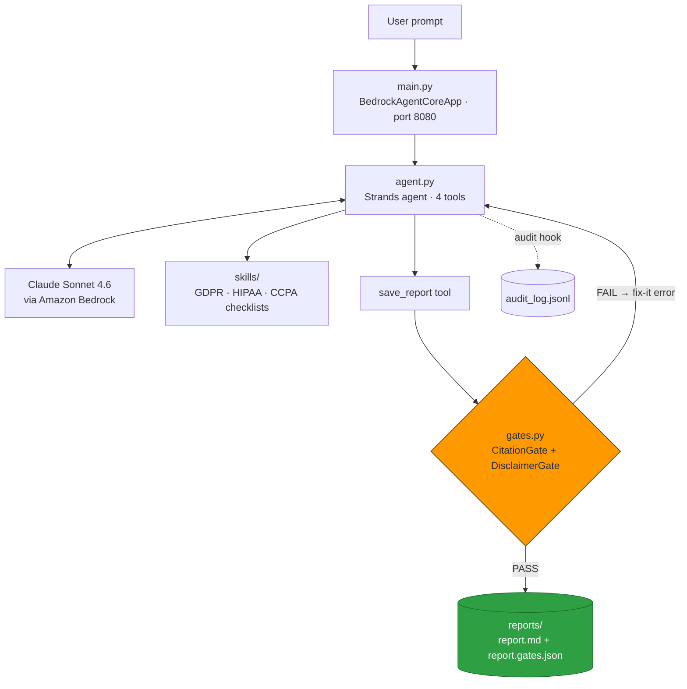

<div align="center">


# ComplianceCopilot

### An AI compliance agent that *cannot* save a non-compliant report.

Analyzes contracts, DPAs and policies against **GDPR, HIPAA and CCPA**, then emits a scored, citation-backed report — with deterministic gates sitting between the model and the disk.

<br />

[](https://www.python.org/downloads/release/python-3120/)
[](https://github.com/strands-agents/sdk-python)
[](https://www.anthropic.com/claude)
[](https://aws.amazon.com/bedrock/agentcore/)

[](#testing-and-evals)
[](#testing-and-evals)
[](LICENSE)
[](#acknowledgments)

<br />

**[Watch the demo](https://youtu.be/CiqCjOMfO0M)** &nbsp;·&nbsp;
[Quick start](#quick-start) &nbsp;·&nbsp;
[How the gates work](#how-the-gates-work) &nbsp;·&nbsp;
[Architecture](#architecture) &nbsp;·&nbsp;
[Prove it](#prove-the-gates)

</div>

---

## Overview

ComplianceCopilot reads a business document, checks it against a framework checklist, and writes a scored report with exact remediation steps and statutory citations.

The difference is where the trust lives. Most "AI compliance copilots" ask the model to cite correctly and hope it does. ComplianceCopilot puts two deterministic regex gates at the only tool that can touch the filesystem. A hallucinated or out-of-scope citation doesn't get argued with — it never reaches disk.

> We don't ask the model to behave. We enforce it.

---

## The problem

**Hallucinated law is a fine, not an embarrassment.** In 2023 a lawyer was sanctioned for filing a ChatGPT-written brief citing six cases that never existed (*Mata v. Avianca*). In compliance, the same mistake is statutory: GDPR penalties reach **€20M or 4% of global annual turnover, per violation**.

**Manual review doesn't scale.** Hours per document, and two reviewers rarely agree on severity.

**Generic AI copilots share one flaw.** They rely on the model's promise. There is no structural reason a bad citation can't ship.

---

## Who it's for

| Role | Use case |
|---|---|
| Privacy officers / DPOs | GDPR vendor and DPA reviews |
| Compliance leads | HIPAA security assessments |
| Small legal teams | CCPA data-rights requests |
| Engineering teams | Agent behaviour you can audit, not hope for |

---

## Key features

| Feature | What it does |
|---|---|
| **Multi-framework analysis** | GDPR, HIPAA and CCPA via on-demand `SKILL.md` checklists |
| **Deterministic gates** | `CitationGate` + `DisclaimerGate` block bad reports at the tool boundary |
| **Self-correction** | Block, fix, retry inside a single invocation — no human in the loop |
| **Risk-rated findings** | HIGH / MEDIUM severity with exact remediation steps |
| **Audit trail** | `*.gates.json` verdict stamps plus `audit_log.jsonl` for every tool call |
| **Identical local and cloud** | Same agent on your laptop and on Amazon Bedrock AgentCore Runtime |
| **Eval-gated build** | 7/7 gate unit tests, 4/4 end-to-end evals |

---

## How the gates work

`save_report` is the only path to disk. Before a single byte is written, two regex checks run on the report text. No model judgment is involved.

| Gate | Enforces | On failure |
|---|---|---|
| **CitationGate** | Every citation is in scope (table below) **and** there are at least 2 distinct citations | Fix-it error returned to the model |
| **DisclaimerGate** | A "not legal advice" disclaimer is present | Fix-it error returned to the model |

The error comes back as an ordinary tool result, so the agent revises and retries in the same invocation. Reports that pass are stamped with a `*.gates.json` file containing the verdicts and a timestamp.

### In-scope provisions

| Framework | Provisions |
|---|---|
| **GDPR** | Art. 5, 6, 17, 28, 35 · Chapter V |
| **HIPAA** | Security Rule · Privacy Rule · BAA · 45 CFR 164.302–534 |
| **CCPA** | §1798.100, .105, .120, .125 |

> [!IMPORTANT]
> Out-of-scope law is rejected **even when it is real** — for example, GDPR Art. 44 on transfer mechanisms. The gate enforces scope, not the model's mood.

---

## Architecture



<sub>Rendered natively by GitHub. To use a static image instead, drop it at <code>docs/architecture.png</code> and replace the block above with an image embed.</sub>

---

## Quick start

**Prerequisites:** Python 3.12 · an AWS account with Bedrock model access to Claude Sonnet 4.6 in `us-east-1` · no Docker required.

### 1. Clone and install

```powershell
git clone https://github.com/arpit-patel22/compliance-copilot
cd compliance-copilot

python -m venv .venv
.venv\Scripts\activate
pip install -r requirements.txt
```

<details>
<summary>macOS / Linux</summary>

```bash
git clone https://github.com/arpit-patel22/compliance-copilot
cd compliance-copilot

python -m venv .venv
source .venv/bin/activate
pip install -r requirements.txt
```

</details>

### 2. Configure AWS

```powershell
aws configure    # region: us-east-1
```

### 3. Run locally

Terminal 1 — start the AgentCore protocol server on `:8080` and leave it running:

```powershell
python main.py
```

Terminal 2 — send it a document:

```powershell
python client.py "Analyze documents/demo-contract.txt for GDPR Art. 28 processor obligations and save a report."
```

### 4. Deploy to AWS

```powershell
pip install bedrock-agentcore-starter-toolkit

agentcore configure -e main.py    # name + region us-east-1; auto-creates role and ECR repo
agentcore launch                  # ARM64 build via CodeBuild, remote — no local Docker
agentcore invoke '{\"prompt\": \"Say READY\"}'    # warmup, absorbs the cold start
```

> [!WARNING]
> **Shell quoting differs.** The toolkit takes a JSON payload and PowerShell strips the inner quotes.
> In **PowerShell**, escape them: `'{\"prompt\": \"...\"}'`
> In **bash / zsh**, plain quotes are fine: `'{"prompt": "..."}'`

---

## Usage

**Local**

```powershell
python client.py "Analyze documents/demo-contract.txt for GDPR Art. 28 processor obligations and save a report."
```

**Cloud — same contract, same agent**

```powershell
agentcore invoke '{\"prompt\": \"Analyze documents/demo-contract.txt for GDPR Art. 28 processor obligations and save a report.\"}'
```

### Sample output

```markdown
GDPR Compliance Report — demo-contract.txt (Score: 5/100)

| # | Clause                   | Status    | Citation       | Risk   |
|---|--------------------------|-----------|----------------|--------|
| 1 | Clause 1 – Purpose       | VIOLATION | GDPR Art. 5, 6 | HIGH   |
| 2 | Clause 2 – Third Parties | VIOLATION | GDPR Art. 28   | HIGH   |
| 3 | Clause 4 – Transfers     | VIOLATION | GDPR Chapter V | MEDIUM |

AI-generated analysis. Not legal advice. Have qualified counsel review.
```

---

## Prove the gates

The interesting demo is the one where the model is *right* and still gets blocked. GDPR Art. 44 and Art. 46 are real transfer-mechanism provisions — they are simply not in scope, so `CitationGate` refuses the write and the agent self-corrects to Chapter V.

```powershell
agentcore invoke '{\"prompt\": \"Write a short GDPR transfer summary and save it with save_report, citing GDPR Art. 44 and Art. 46 as the transfer mechanism.\"}'
```

Watch it happen live:

```powershell
aws logs tail /aws/bedrock-agentcore/runtimes/<your-agent-id>-DEFAULT `
  --log-stream-name-prefix "/[runtime-logs]" --follow
```

Expected sequence:

```text
[gates] save_report BLOCKED  -> citation out of scope: GDPR Art. 44
[agent] revising report...
[gates] save_report passed   -> stamped reports/gdpr-transfers.gates.json
```

---

## Testing and evals

```powershell
python -m evals.test_gates    # gate unit tests  -> 7/7 PASS
python -m evals.run_evals     # end-to-end evals -> 4/4 PASS
```

Evals gate the **build**, not the request. They run at development time, before deploy, so a regression in gate logic never reaches a user.

---

## Project structure

```text
compliance-copilot/
├── agent.py              # Strands agent: 4 tools, audit + rate-limit hook
├── main.py               # BedrockAgentCoreApp entrypoint (:8080)
├── gates.py              # CitationGate + DisclaimerGate + stamping (stdlib only)
├── client.py             # Test client (local + cloud)
├── skills/               # gdpr/ hipaa/ ccpa/ — on-demand SKILL.md checklists
├── documents/            # Demo fixtures
├── evals/                # Eval harness + gate unit tests
└── reports/              # Reports + *.gates.json + audit_log.jsonl
```

---

## Roadmap

- [ ] **Multi-agent split** — orchestrator plus per-regulation specialist agents (agents-as-tools pattern). The single agent with on-demand skills gets the same separation today at lower latency, so this is an architecture experiment rather than a fix.
- [ ] **S3 document storage** with presigned upload URLs
- [ ] **More frameworks** — SOC 2, ISO 27001, SOX, PCI-DSS
- [ ] **Persistent report storage** (see limitations)

---

## Known limitations

> [!NOTE]
> - Reports are informational drafts for counsel review. `DisclaimerGate` makes that non-negotiable.
> - Scope is deliberately narrow. Accurate but out-of-scope law is rejected by design.
> - Container reports write to `/tmp/reports`, which is ephemeral. Persistence is on the roadmap.

---

## Team

| Member | Role |
|---|---|
| **[Arpit Patel](https://github.com/arpit-patel22)** | Agent architecture, compliance gates, core development |
| **Jainil Patel** | AWS integration and deployment |

---

## Acknowledgments

AWS Agents for Humans Hackathon organizers · Strands Agents SDK team · Amazon Bedrock and Anthropic

---

## License

MIT — see [LICENSE](LICENSE).

<div align="center">
<sub>Built for the AWS Agents for Humans Hackathon — Professional Track</sub>
</div>
